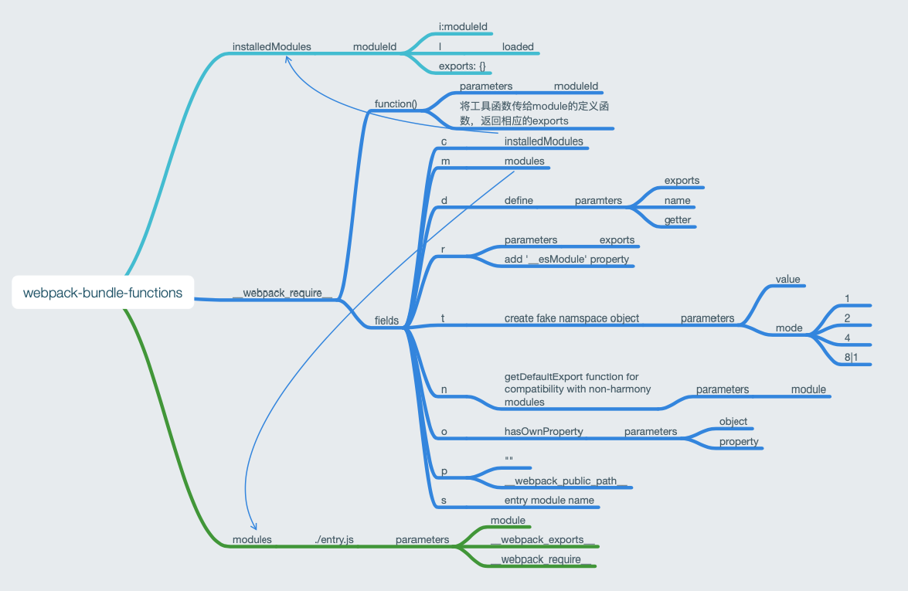

Webpack Config Functions in Bundle Demo
=======================================

生成并简单分析一下由webpack生成的bundle文件里面包含的函数。

在没有指定libraryTarget的时候，其默认值为`var`，所以在本demo中，生成的bundle文件的格式类型就是它。
如果我们指定其它的值，最后生成的代码可能会有不同。

```
npm install
npm run demo
```



基本过程是这样的：

首先，将我们在webpack.config.js里定义的entry文件及其内容组装成一个modules对象，
其key为文件路径，value为为一个函数，函数里包含了entry文件里的内容，并传入了一个webpack定义的工具对象
`__webpack_require__`，通过调用它提供的相关方法，生成一个exports对象，包含了模块向外暴露的元素。

所以一切的关键就在于这个`__webpack_require__`。它本身是一个函数，在最开始的时候被调用，
作用是生成一个module对象，用来保存moduleId及最后收集到的exports。同时，它还附带了一些信息或者工具函数，
用于对exports进行修饰，比如增加`__esModule`，定义getter，生成fake namespace object等等，
总之就是要把我们自己写的代码，变成满足一定规则的模块，使得外界可以以相应的模块规则与之交互。

本Demo的重点不在具体的模块规则上，而是在`__webpack_require__`相关的几个函数上。

